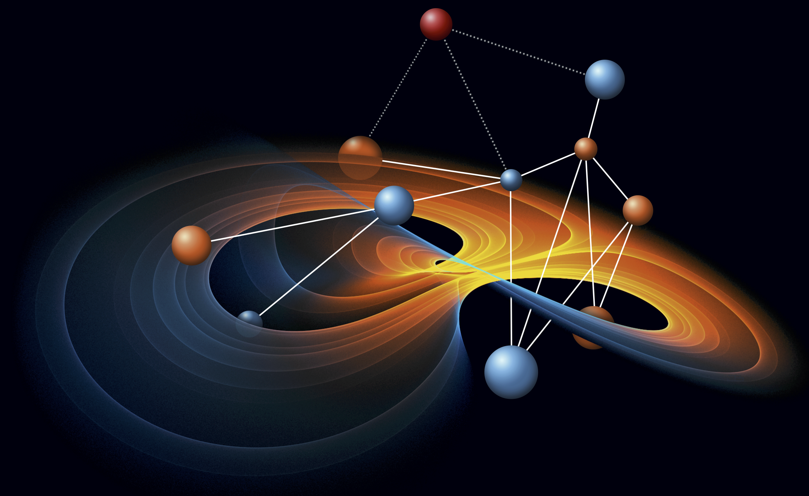

# Welcome to the Computational Ecology Lab!
{: .display-4}
 
We are part of the [Department of Biosciences](https://www.swansea.ac.uk/bioscience/), at Swansea University.
{: .welcomefont}

{:style="max-width: 100%; height: auto;"}

Research in the lab is focused on discovering the mechanisms behind the emergence of structure and organisation of complex ecological networks from microbial communities to macro-ecosystems, with the ultimate goal of understanding the assembly and disassembly of ecosystems. We are interested in developing theoretical models to understand and predict the behaviour of complex ecosystems from first principles and how they will respond to change. We also aim at revealing patterns of organisation of complex communities from large datasets of empirical systems.
{: .welcomefont}
